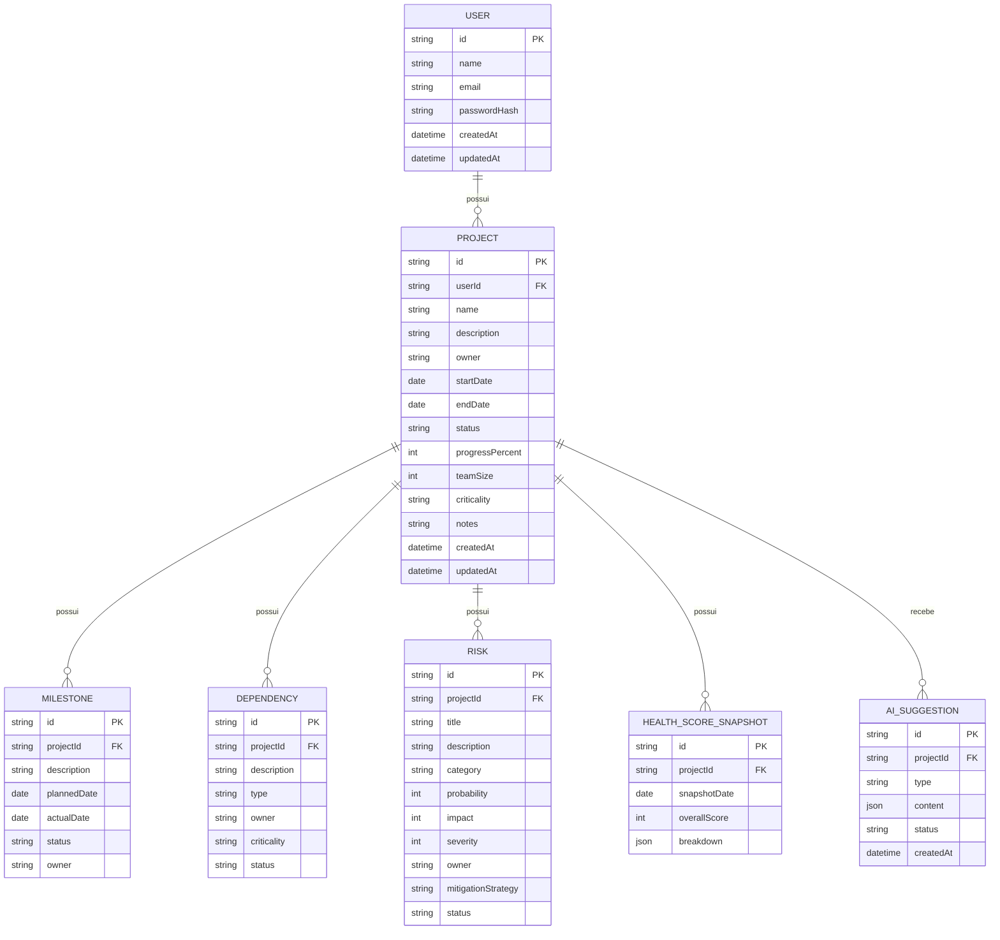
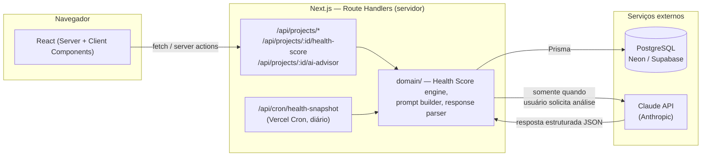

# ARCHITECTURE — Project Risk AI

## 1. Visão geral

Aplicação **fullstack unificada em Next.js (App Router) + TypeScript**, com PostgreSQL como armazenamento e a API do Claude acessada exclusivamente por código de servidor (API Routes / Route Handlers). Um único repositório, um único processo de deploy.

### Por que não React SPA + Node/Express separado?

A proposta original sugeria frontend e backend como projetos distintos. Optamos por unificar em Next.js porque, para o escopo deste projeto:

- elimina CORS, dois servidores locais e dois pipelines de deploy;
- TypeScript compartilhado ponta a ponta (tipos de domínio, schemas Zod) sem pacote separado;
- Route Handlers do Next.js já satisfazem o requisito "chamadas à API do Claude só no backend" sem precisar de um servidor Express adicional;
- reduz superfície de configuração (menos arquivos de infraestrutura) sem abrir mão de organização em camadas dentro do próprio projeto.

A separação física front/back só se justificaria se houvéssemos previsto múltiplos consumidores de API (mobile nativo, integrações de terceiros) — não é o caso do MVP.

## 2. Stack

| Camada                        | Escolha                                | Motivo                                                                                                |
| ----------------------------- | -------------------------------------- | ----------------------------------------------------------------------------------------------------- |
| Framework fullstack           | Next.js 14+ (App Router)               | Server Components + Route Handlers cobrem front e back num só projeto                                 |
| Linguagem                     | TypeScript (strict)                    | Tipagem ponta a ponta, menos bugs em runtime                                                          |
| UI                            | React + Tailwind CSS + shadcn/ui       | Componentes acessíveis, produtividade alta, boa aparência sem design system próprio                   |
| Gráficos                      | Recharts (ou similar leve)             | Suficiente para série temporal do Health Score e indicadores do dashboard                             |
| Estado de servidor no cliente | React Query (TanStack Query)           | Cache, refetch, loading/error states padronizados                                                     |
| Validação                     | Zod                                    | Schemas compartilhados entre formulários (cliente) e Route Handlers (servidor)                        |
| ORM                           | Prisma                                 | Migrations versionadas, tipos gerados a partir do schema, boa DX com Postgres                         |
| Banco de dados                | PostgreSQL                             | Relacional, adequado ao modelo de entidades com relações claras; free tier disponível (Neon/Supabase) |
| IA                            | Anthropic SDK (`@anthropic-ai/sdk`)    | Chamado só em Route Handlers do servidor                                                              |
| Autenticação                  | `jose` (JWT assinado, HS256)           | Sessão stateless em cookie httpOnly, `User` no Postgres; sem biblioteca de IAM completa — ver §12     |
| Testes unitários              | Vitest                                 | Rápido, boa integração com TS/Vite                                                                    |
| Testes de componente          | React Testing Library                  | Padrão de mercado para React                                                                          |
| Lint/format                   | ESLint + Prettier                      | Consistência de código                                                                                |
| Deploy app                    | Vercel                                 | Nativo para Next.js, free tier, deploy por push                                                       |
| Deploy banco                  | Neon ou Supabase (Postgres gerenciado) | Free tier, sem servidor próprio para manter                                                           |
| Local dev (DB)                | Docker Compose (Postgres)              | Ambiente local idêntico ao de produção sem depender de serviço externo                                |

Sem Redux, sem microsserviços, sem fila de mensagens, sem GraphQL — nenhum desses resolve um problema real neste escopo.

## 3. Estrutura de diretórios (proposta)

```
project-risk-ai/
├── prisma/
│   ├── schema.prisma
│   └── migrations/
├── src/
│   ├── app/
│   │   ├── (dashboard)/
│   │   │   └── page.tsx                 # Dashboard executivo
│   │   ├── projects/
│   │   │   ├── page.tsx                 # Lista de projetos
│   │   │   ├── new/page.tsx
│   │   │   └── [projectId]/
│   │   │       ├── page.tsx             # Detalhe do projeto
│   │   │       ├── milestones/
│   │   │       ├── dependencies/
│   │   │       ├── risks/
│   │   │       └── ai-advisor/
│   │   └── api/
│   │       ├── projects/route.ts
│   │       ├── projects/[projectId]/route.ts
│   │       ├── projects/[projectId]/milestones/route.ts
│   │       ├── projects/[projectId]/dependencies/route.ts
│   │       ├── projects/[projectId]/risks/route.ts
│   │       ├── projects/[projectId]/health-score/route.ts
│   │       ├── projects/[projectId]/ai-advisor/route.ts
│   │       └── cron/health-snapshot/route.ts
│   ├── domain/
│   │   ├── health-score/
│   │   │   ├── calculate.ts             # função pura, testável isoladamente
│   │   │   └── calculate.test.ts
│   │   ├── risks/
│   │   └── ai-advisor/
│   │       ├── buildPrompt.ts
│   │       ├── parseResponse.ts
│   │       └── claudeClient.ts
│   ├── lib/
│   │   ├── prisma.ts
│   │   └── validation/                  # schemas Zod compartilhados
│   ├── components/
│   │   ├── ui/                          # shadcn primitives
│   │   └── domain/                      # ProjectCard, RiskTable, HealthGauge...
│   └── types/
├── .env.example
├── docker-compose.yml
└── package.json
```

Princípio: `domain/` contém lógica de negócio pura (Health Score, construção de prompt, parsing de resposta da IA), testável sem subir servidor ou banco. `app/api/*` é fina — só orquestra validação, chamada ao domínio e resposta HTTP.

## 4. Modelo de dados

### Entidades

- **User** — 1:N Project (dono do projeto — ver §12)
- **Project** — N:1 User; 1:N Milestone, Dependency, Risk, HealthScoreSnapshot, AiSuggestion
- **Milestone** — N:1 Project
- **Dependency** — N:1 Project
- **Risk** — N:1 Project
- **HealthScoreSnapshot** — N:1 Project (histórico)
- **AiSuggestion** — N:1 Project (sugestões da IA, nunca dados oficiais)

### Diagrama de entidade-relacionamento (Mermaid)



### Notas sobre o modelo

- **`AiSuggestion.content`** guarda o JSON estruturado retornado pela IA (título, descrição, categoria, probabilidade/impacto sugeridos, mitigação sugerida) — nunca é lido diretamente como um `Risk`. Uma tela de revisão transforma isso em um formulário pré-preenchido de criação de risco.
- **`AiSuggestion.status`**: `pending` | `accepted` | `dismissed`. Ao aceitar, o backend cria o `Risk` real a partir dos dados confirmados pelo usuário (que pode editar antes de salvar) e marca a sugestão como `accepted`.
- **`HealthScoreSnapshot.breakdown`** guarda o detalhamento por dimensão (Prazo, Escopo, Dependências, Recursos, Riscos) e as penalizações que geraram o `overallScore` — é o que torna o score auditável (ver `HEALTH_SCORE.md`).
- **`User`** — 1:N `Project` (dono do projeto, ver §12). Decisão anterior ("sem tabela `User` no MVP") foi revertida quando a autenticação evoluiu de single-admin para multiusuário real — ver §12 para a migração dos dados existentes.
- Os campos `owner` em `Project`, `Milestone`, `Dependency` e `Risk` continuam texto livre — são o responsável _dentro_ do projeto (que pode não ter conta no sistema), não a conta que autentica e possui o projeto (`Project.userId`). Essas são coisas diferentes de propósito e não foram unificadas.

## 5. Fluxo de arquitetura



Pontos-chave:

- O navegador **nunca** fala diretamente com o Postgres ou com a Claude API — sempre via Route Handlers do próprio Next.js.
- O Health Score é calculado por uma função pura em `domain/health-score/calculate.ts`, sem chamar a Claude API — é 100% determinístico (RNF01).
- O AI Risk Advisor é acionado **apenas sob demanda explícita do usuário** (botão "Analisar com IA"), nunca automaticamente a cada carregamento de página — controla custo e respeita o princípio de a IA não atuar por conta própria.

## 6. Estratégia de API

REST simples sobre Route Handlers do Next.js, um recurso por entidade, aninhado sob `projects/:id` onde faz sentido (milestones, dependências, riscos pertencem sempre a um projeto).

| Método           | Rota                                       | Descrição                                                  |
| ---------------- | ------------------------------------------ | ---------------------------------------------------------- |
| GET/POST         | `/api/projects`                            | Lista / cria projetos                                      |
| GET/PATCH/DELETE | `/api/projects/:id`                        | Detalhe / atualiza / soft-delete                           |
| GET/POST         | `/api/projects/:id/milestones`             | Lista / cria marcos                                        |
| PATCH/DELETE     | `/api/milestones/:id`                      | Atualiza / remove marco                                    |
| GET/POST         | `/api/projects/:id/dependencies`           | Lista / cria dependências                                  |
| PATCH/DELETE     | `/api/dependencies/:id`                    | Atualiza / remove dependência                              |
| GET/POST         | `/api/projects/:id/risks`                  | Lista / cria riscos                                        |
| PATCH/DELETE     | `/api/risks/:id`                           | Atualiza / remove risco                                    |
| GET              | `/api/projects/:id/health-score`           | Score atual + breakdown, recalculado on-demand             |
| GET              | `/api/projects/:id/health-score/history`   | Série histórica de snapshots                               |
| POST             | `/api/projects/:id/ai-advisor`             | Dispara análise da IA (com cooldown)                       |
| GET              | `/api/projects/:id/ai-advisor/suggestions` | Lista sugestões pendentes/decididas                        |
| POST             | `/api/ai-advisor/suggestions/:id/accept`   | Aceita sugestão → gera rascunho de risco                   |
| POST             | `/api/ai-advisor/suggestions/:id/dismiss`  | Descarta sugestão                                          |
| GET              | `/api/dashboard`                           | Agregados de portfólio para o dashboard executivo          |
| POST             | `/api/cron/health-snapshot`                | Endpoint chamado pelo Vercel Cron (autenticado por secret) |

Todas as rotas de escrita validam o corpo da requisição com Zod antes de tocar o Prisma. Erros de validação retornam 400 com detalhe de campo; erros inesperados retornam 500 com mensagem genérica (sem vazar stack trace em produção).

## 7. Integração com a API do Claude

- SDK oficial `@anthropic-ai/sdk`, instanciado apenas em código de servidor (`domain/ai-advisor/claudeClient.ts`), nunca importado por um Client Component.
- Chave lida de `process.env.ANTHROPIC_API_KEY`, presente só no ambiente de servidor (Vercel env vars / `.env` local, nunca commitado).
- **Prompt determinístico e estruturado**: `buildPrompt.ts` monta o prompt a partir do estado atual do projeto (dados de `Project`, `Milestone`, `Dependency`, `Risk` abertos, e o breakdown do Health Score) — não a partir de texto livre do usuário, reduzindo risco de prompt injection via dados do próprio projeto.
- **Saída estruturada**: usa tool use / JSON schema no pedido ao Claude para obter uma resposta em formato previsível; `parseResponse.ts` valida a resposta com Zod antes de persistir como `AiSuggestion`. Resposta que falha na validação é descartada com erro tratado, não repassada ao usuário como se fosse válida.
- **Timeout**: requisição à Claude API com timeout explícito (ex.: 30s); timeout ou erro de rede retorna erro tratado ao frontend ("IA temporariamente indisponível"), sem afetar o restante da aplicação (RNF03).
- **Rate limiting / controle de custo**: cooldown por projeto (ex.: uma análise a cada N minutos), validado no backend antes de chamar a API — evita disparo repetido acidental ou abusivo.
- **Indisponibilidade da API**: tratada como erro esperado (try/catch dedicado), com mensagem clara na UI; nenhuma outra funcionalidade do sistema depende da Claude API para funcionar.
- Nenhuma chamada à Claude API ocorre em background/cron automaticamente — sempre por ação explícita do usuário, reforçando "Decision Support System, não autoridade automática".

## 8. Segurança

- Variáveis sensíveis (`DATABASE_URL`, `ANTHROPIC_API_KEY`, `CRON_SECRET`, `AUTH_SECRET`) apenas em `.env` (local, git-ignorado) e nas env vars da Vercel; `.env.example` documenta as chaves sem valores reais.
- Validação de entrada com Zod em toda rota de API antes de qualquer escrita no banco.
- Prisma como camada de acesso a dados elimina SQL injection por construção (queries parametrizadas).
- Sem `dangerouslySetInnerHTML`; toda renderização de texto do usuário (inclusive conteúdo vindo da IA) passa pelo escaping padrão do React.
- Endpoint de cron (`/api/cron/health-snapshot`) protegido por um secret compartilhado (header verificado no handler), independente da autenticação de usuário (ver §12) — não é uma rota acessada por um usuário logado.
- Autenticação de usuário via sessão assinada em cookie (ver §12), com todas as páginas e endpoints funcionais exigindo sessão válida, exceto a própria tela de login e o endpoint de cron.
- Dependências mantidas atualizadas via Dependabot/`npm audit` (recomendado configurar no GitHub).

## 9. Tratamento de erros

- Camada `domain/` lança erros tipados (ex.: `ValidationError`, `AiAdvisorUnavailableError`, `NotFoundError`); Route Handlers traduzem esses tipos em códigos HTTP apropriados (400, 404, 503, 500).
- Frontend usa React Query, que já expõe estados `isLoading`, `isError`, `data` — cada tela trata explicitamente os três (spinner, mensagem de erro com retry, conteúdo).
- Estados vazios (nenhum projeto, nenhum risco cadastrado) têm componentes dedicados com call-to-action, não apenas uma tabela em branco.

## 10. Estratégia de testes

- **Unitários (Vitest)**: prioridade máxima em `domain/health-score/calculate.ts` — é a lógica mais sensível a erro silencioso, com casos de teste cobrindo os exemplos documentados em `HEALTH_SCORE.md` (score saudável, atenção, risco, crítico, casos extremos).
- **Unitários**: `buildPrompt.ts` e `parseResponse.ts` do AI Advisor testados isoladamente com mocks — sem chamar a API real do Claude em CI.
- **Componentes (React Testing Library)**: componentes de domínio críticos (tabela de riscos, indicador de Health Score, formulários com validação).
- **Integração**: Route Handlers principais testados contra um banco de teste (ex.: Postgres efêmero via Docker em CI ou SQLite em memória apenas para testes, se viável com Prisma).
- **E2E (Playwright)**: adiado para a Fase 7, opcional — cobrindo o fluxo crítico (criar projeto → registrar risco → ver Health Score mudar).

## 11. Estratégia de deploy

- **Aplicação**: Vercel, deploy automático a partir da branch principal do GitHub; variáveis de ambiente configuradas no painel da Vercel.
- **Banco de dados**: Neon ou Supabase (Postgres gerenciado, free tier) para produção/demo pública; Docker Compose local para desenvolvimento.
- **Migrations**: `prisma migrate deploy` executado como parte do pipeline de deploy (build step na Vercel ou GitHub Action prévia).
- **Cron do snapshot diário**: Vercel Cron (free tier permite execução diária), chamando `/api/cron/health-snapshot`.
- **CI (GitHub Actions, Fase 7)**: lint + typecheck + testes em cada PR antes de permitir merge.

## 12. Autenticação e multiusuário

A primeira versão desta camada (ver histórico do repositório) era single-admin, com credencial única via variáveis de ambiente e sem tabela `User` — mantida apenas o tempo suficiente para proteger a Live Demo pública logo após o MVP. Essa decisão foi revertida: o modelo atual é multiusuário real, com cadastro público e isolamento de dados por conta, ainda sem se tornar uma implementação de IAM completa (sem RBAC, sem organizações/equipes, sem multi-tenancy empresarial — ver `PRD.md` §12 e `ROADMAP.md`).

### Contas e sessão

- **Tabela `User`** (`id`, `name`, `email` único, `passwordHash`). Cadastro público em `/signup`; a senha nunca é armazenada em texto puro — `scrypt` (nativo do Node, sem dependência extra), com verificação em tempo constante mesmo para e-mail desconhecido no login, para não vazar por timing se a conta existe.
- **Sessão stateless assinada**: um cookie `httpOnly`, `Secure` em produção, `SameSite=Lax` guarda um JWT (HS256, `jose`) cujo `sub` é o `User.id` real, assinado com `AUTH_SECRET`, válido por 7 dias. Não há tabela de sessões — validar a sessão é apenas verificar a assinatura e a expiração do token, sem consulta ao banco (a consulta ao `User` só acontece quando o dado do usuário é necessário, ex.: login).
- **Proxy** (`src/proxy.ts` — este Next.js renomeou `middleware.ts` para `proxy.ts`, mesma função, ver `node_modules/next/dist/docs/.../proxy.md`): roda em todas as rotas (runtime Node.js, padrão desta versão do Next.js) e faz a checagem "otimista" — sem sessão válida, redireciona páginas para `/login` e responde `401` a chamadas de API, exceto `/login`, `/signup`, `/api/auth/login`, `/api/auth/signup`, `/api/auth/logout` (precisa funcionar mesmo com sessão expirada/inválida — é o próprio endpoint que limpa o cookie) e `/api/cron/health-snapshot` (que mantém seu próprio secret, independente de sessão de usuário). O `matcher` do proxy também não intercepta as rotas geradas `/opengraph-image` e `/twitter-image` (imagem de social preview 1200×630, `next/og`), assim como já não interceptava `favicon.ico` e os assets de `_next` — são recursos públicos que os crawlers de link (LinkedIn, WhatsApp, Facebook) buscam sem sessão.
- **Defesa em profundidade nos Route Handlers**: o Proxy sozinho não é a única proteção — cada Route Handler funcional chama `requireSession(request)` (`src/lib/auth/dal.ts`), que retorna `{ userId }` lendo o cookie diretamente do header `Cookie` da própria `Request` (não via `next/headers`), o que também mantém os Route Handlers testáveis chamando-os diretamente, como já era feito nos testes de integração existentes.
- **Cadastro/login/logout**: `POST /api/auth/signup` valida nome/e-mail/senha (Zod), rejeita e-mail duplicado (`409`, inclusive contra corrida de concorrência via o código de erro do Prisma) e já emite sessão (login automático); `POST /api/auth/login` valida e-mail/senha e emite a sessão; `POST /api/auth/logout` limpa o cookie. Nenhum dos três exige sessão prévia.
- **Telas de cadastro e login** (`/signup`, `/login` — únicas páginas de interface públicas): mesmo padrão visual navy/slate da aplicação, com link cruzado entre as duas, estado de carregamento e mensagem de erro genérica no login ("E-mail ou senha inválidos.") para não revelar qual campo está incorreto.

### Isolamento de dados por usuário

- `Project.userId` (obrigatório, FK para `User`, `onDelete: Cascade`) é a fonte única de verdade sobre a posse de um projeto. `Milestone`, `Dependency`, `Risk`, `HealthScoreSnapshot` e `AiSuggestion` não têm `userId` próprio — a posse é herdada do `Project` ao qual pertencem via `projectId`.
- Toda consulta de projeto (listagem, detalhe, edição, exclusão) filtra por `userId` da sessão **e** `deletedAt: null`. Todo acesso a um recurso filho "por ID" (marco, dependência, risco, sugestão de IA) verifica a posse via filtro de relação `where: { project: { userId, deletedAt: null } }` antes de retornar ou alterar qualquer coisa — a checagem de `deletedAt` fica embutida na própria operação, não depende de quem chama já ter filtrado antes.
- Um projeto com soft-delete fica congelado por completo, inclusive para o próprio dono: seus marcos, dependências, riscos e sugestões de IA não podem mais ser editados, excluídos ou processados diretamente por ID (não é só uma questão de esconder da listagem — a mutação em si é recusada com 404). Isso vale mesmo que o usuário já conheça o ID do recurso de antes da exclusão do projeto.
- Uma tentativa de acessar o recurso de outro usuário — inclusive trocando o ID na URL — retorna **404**, não 403: o sistema nunca confirma que o recurso existe para quem não é dono dele.
- O cron de snapshot diário (`snapshotAllActiveProjects`) continua percorrendo todos os projetos ativos (`deletedAt: null`) de todos os usuários — é um job de sistema, não uma operação de um usuário específico, e permanece protegido só por `CRON_SECRET`.

### Migração dos dados existentes

Como já havia projetos em produção antes da tabela `User` existir, `Project.userId` foi introduzido em duas migrations, deliberadamente separadas para nunca arriscar apagar ou quebrar nada:

1. `20260828100000_add_user_table` — cria `User`; adiciona `Project.userId` **opcional**. Nenhum comportamento muda ainda. **Aplicada em produção.**
2. `20260828110000_require_project_owner` — marca `userId` como `NOT NULL`. Só pode ser aplicada depois de zero linhas com `userId IS NULL`, por design (a migration falha imediatamente contra linhas existentes, o que é intencional). **Ainda não aplicada em produção** — hoje a coluna segue opcional no banco, embora o schema/Prisma Client já a tratem como obrigatória; é segura de aplicar a qualquer momento, já que não há mais nenhum projeto órfão (ver abaixo).

`scripts/backfill-project-owner.mjs` existe para o caso geral de associar projetos pré-existentes a uma conta real antes do passo 2 — mas não foi essa a situação encontrada aqui: os 7 projetos que existiam em produção antes da tabela `User` (criados durante o desenvolvimento/testes anteriores à autenticação, quando a aplicação ainda era pública) foram identificados como massa de teste (nomes/descrições como "Teste", responsável repetido igual ao nome de quem testava, a maioria já removida via soft-delete pela própria aplicação) e confirmados como não sendo dados reais. Por decisão explícita, esses 7 projetos e todos os seus registros dependentes (marcos, dependências, riscos, snapshots de Health Score, sugestões de IA) foram removidos por **hard delete excepcional, direto no banco** — não pelo fluxo normal da aplicação, que continua sendo soft-delete —, deixando o banco de produção sem nenhum projeto órfão. O script de backfill permanece disponível caso uma situação real de migração de dados apareça no futuro.

### Proteção do AI Risk Advisor contra abuso

O cooldown de 5 minutos por projeto (`assertCooldownElapsed`) já existia, mas sozinho não limita um usuário disparando análises em vários projetos em sequência. Um segundo controle, por usuário, foi adicionado: no máximo 20 análises a cada 24 horas por conta (contadas pelas sugestões do tipo `EXECUTIVE_SUMMARY`, exatamente uma por análise), verificado antes de qualquer chamada à Anthropic API. Ambos os limites disparam antes do `runAiAnalysis`, então nunca geram custo de API.
