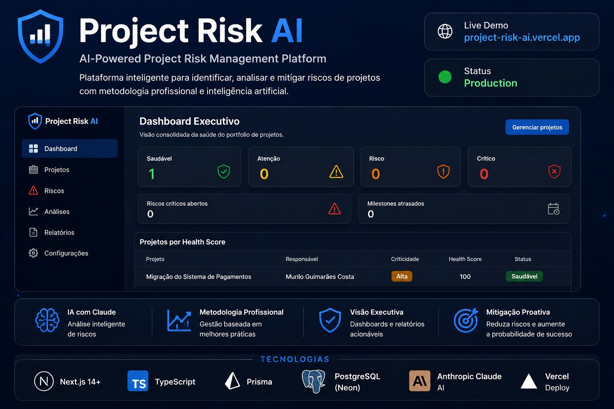

# Project Risk AI

> Plataforma inteligente para monitoramento preventivo de riscos e saúde de projetos de TI.

Case profissional de desenvolvimento assistido por **Claude Code**, da análise de produto e arquitetura à implementação, testes, hardening e publicação em produção, com as principais decisões documentadas ao longo do projeto.

🚀 **Live Demo:** https://project-risk-ai.vercel.app/

**Status atual: MVP concluído e publicado em produção. As 7 fases previstas no roadmap foram executadas, incluindo testes, CI, revisão de segurança, integração com Claude API, banco PostgreSQL em produção e deploy na Vercel.**

Consulte o detalhamento em [ROADMAP.md](ROADMAP.md).



---

## 1. Problema

Em projetos de TI, riscos importantes muitas vezes são identificados tarde demais ou ficam dispersos em planilhas, atas e percepções individuais dos gestores.

Não existe, necessariamente, um ponto único que consolide sinais como atrasos, dependências críticas, riscos sem mitigação e evolução do projeto, traduzindo essas informações em um indicador simples, explicável e auditável.

---

## 2. Solução

O **Project Risk AI** centraliza informações relevantes do projeto — cronograma, marcos, dependências e riscos — e produz:

- um **Health Score de 0 a 100**, determinístico, explicável e auditável por projeto;
- um **Dashboard Executivo** para leitura rápida da saúde do portfólio;
- um **AI Risk Advisor**, integrado à API do Claude, que atua como apoio à decisão e pode identificar potenciais riscos e sugerir estratégias de mitigação.

A Inteligência Artificial não altera automaticamente os dados do projeto. Toda sugestão exige avaliação e confirmação explícita do usuário.

Documentação completa do produto: [PRD.md](PRD.md).

---

## 3. Arquitetura

A aplicação utiliza uma arquitetura **fullstack unificada em Next.js (App Router) + TypeScript**, com PostgreSQL acessado via Prisma e a API do Claude consumida exclusivamente por código executado no servidor.

### Arquitetura de produção

```text
Usuário / Browser
        │
        ▼
     Vercel
        │
        ▼
Next.js / React
        │
        ▼
Route Handlers / API
        │
        ├──────────────► Health Score Engine
        │
        ├──────────────► Prisma
        │                    │
        │                    ▼
        │             PostgreSQL / Neon
        │
        └──────────────► AI Risk Advisor
                             │
                             ▼
                       Claude API
                       (Anthropic)
```

O navegador nunca acessa diretamente o banco de dados ou a Claude API.

O detalhamento técnico, modelo de dados e decisões arquiteturais estão documentados em [ARCHITECTURE.md](ARCHITECTURE.md).

---

## 4. Funcionalidades

O MVP contempla:

- gestão de projetos;
- cadastro e acompanhamento de milestones;
- gestão de dependências;
- registro de riscos;
- cálculo automático de severidade;
- Health Score com breakdown por dimensão;
- histórico da evolução do Health Score;
- Dashboard Executivo;
- AI Risk Advisor;
- geração de sugestões de riscos;
- sugestões de mitigação;
- fluxo de aceitar ou descartar sugestões da IA;
- persistência em PostgreSQL.

O detalhamento completo dos requisitos funcionais RF01–RF09 está disponível em [PRD.md](PRD.md).

---

## 5. Tecnologias

| Camada           | Tecnologia                        |
| ---------------- | --------------------------------- |
| Framework        | Next.js (App Router) + TypeScript |
| UI               | React + Tailwind CSS + shadcn/ui  |
| ORM              | Prisma (`@prisma/adapter-pg`)     |
| Banco de dados   | PostgreSQL                        |
| Database Hosting | Neon                              |
| IA               | Anthropic Claude API              |
| SDK IA           | `@anthropic-ai/sdk`               |
| Validação        | Zod                               |
| Gráficos         | Recharts                          |
| Testes           | Vitest + React Testing Library    |
| Lint / Format    | ESLint + Prettier                 |
| Deploy           | Vercel                            |

---

## 6. Inteligência Artificial

O **AI Risk Advisor** foi desenvolvido como um **Decision Support System**.

A Claude API pode:

- identificar potenciais riscos ainda não cadastrados;
- detectar sinais de deterioração;
- sugerir estratégias de mitigação;
- classificar probabilidade e impacto;
- gerar recomendações;
- produzir análises executivas.

Porém, a IA nunca cria, edita ou aprova dados oficiais por conta própria.

O fluxo é sempre:

```text
Claude identifica uma situação
        │
        ▼
Sugestão da IA
        │
        ▼
Usuário revisa
        │
        ├──► Aceitar
        │
        └──► Descartar
```

Nenhuma chamada à Claude API ocorre diretamente pelo frontend e a API Key nunca é exposta ao navegador.

A aplicação continua funcional mesmo que o serviço de IA esteja temporariamente indisponível.

Detalhes de integração, tratamento de erros, timeout e controle de chamadas estão documentados em [ARCHITECTURE.md](ARCHITECTURE.md).

---

## 7. Health Score

O **Project Health Score** utiliza uma metodologia matemática determinística, sem participação de IA no cálculo.

```text
Health Score = 100 − Σ penalidades
```

As dimensões utilizadas no MVP são:

| Dimensão     | Penalização máxima |
| ------------ | -----------------: |
| Riscos       |                 30 |
| Prazo        |                 25 |
| Dependências |                 20 |
| Escopo       |                 15 |
| Recursos     |                 10 |
| **Total**    |            **100** |

### Classificação

|  Score | Classificação |
| -----: | ------------- |
| 90–100 | Saudável      |
|  75–89 | Atenção       |
|  60–74 | Risco         |
|   0–59 | Crítico       |

O cálculo é:

- determinístico;
- explicável;
- auditável;
- reproduzível;
- independente da IA.

Pesos, penalizações, regras e exemplos completos estão documentados em [HEALTH_SCORE.md](HEALTH_SCORE.md).

---

## 8. Como executar localmente

### Pré-requisitos

- Node.js 20+
- npm
- PostgreSQL local
- Docker, opcional mas recomendado
- Anthropic API Key, caso queira testar o AI Risk Advisor

### Clone o projeto

```bash
git clone https://github.com/Murilo58/project-risk-ai.git
cd project-risk-ai
```

### Instale as dependências

```bash
npm install
```

### Configure o ambiente

Copie o arquivo de exemplo:

```bash
cp .env.example .env
```

Configure as variáveis necessárias no `.env`.

### Banco de dados — opção A: Docker

```bash
docker compose up -d
```

O `docker-compose.yml` cria um PostgreSQL compatível com a configuração local documentada no projeto.

### Banco de dados — opção B: Prisma local

```bash
npx prisma dev
```

Utilize a `DATABASE_URL` fornecida no terminal para configurar o `.env`.

### Aplicar migrations

```bash
npx prisma migrate dev
```

### Executar a aplicação

```bash
npm run dev
```

Acesse:

http://localhost:3000

---

### Scripts disponíveis

| Script                      | Descrição                            |
| --------------------------- | ------------------------------------ |
| `npm run dev`               | Servidor de desenvolvimento          |
| `npm run build`             | Build de produção                    |
| `npm run lint`              | Executa ESLint                       |
| `npm run typecheck`         | Verificação de tipos com TypeScript  |
| `npm run format`            | Formatação com Prettier              |
| `npm run test`              | Executa a suíte de testes com Vitest |
| `npx prisma studio`         | Interface para inspeção do banco     |
| `npx prisma migrate dev`    | Migration em desenvolvimento         |
| `npx prisma migrate deploy` | Aplica migrations em produção        |

---

## 9. Configuração

As variáveis de ambiente são documentadas em [`.env.example`](.env.example).

Principais variáveis:

```env
DATABASE_URL=
ANTHROPIC_API_KEY=
ANTHROPIC_MODEL=
CRON_SECRET=
```

### `DATABASE_URL`

Connection string PostgreSQL.

Em produção, o projeto utiliza **Neon PostgreSQL** com conexão pooled para execução serverless na Vercel.

### `ANTHROPIC_API_KEY`

Chave utilizada exclusivamente pelo backend para acessar a Claude API.

### `ANTHROPIC_MODEL`

Define o modelo Claude utilizado pelo AI Risk Advisor.

### `CRON_SECRET`

Protege o endpoint utilizado para geração automática de snapshots do Health Score.

> Nenhuma credencial real deve ser versionada no GitHub. O arquivo `.env` está incluído no `.gitignore`.

---

## 10. Deploy

O **Project Risk AI está publicado em produção**.

### Live Demo

🚀 https://project-risk-ai.vercel.app/

### Infraestrutura de produção

| Componente  | Serviço              |
| ----------- | -------------------- |
| Aplicação   | Vercel               |
| Framework   | Next.js              |
| Banco       | Neon PostgreSQL      |
| ORM         | Prisma               |
| IA          | Anthropic Claude API |
| Repositório | GitHub               |

O banco de produção foi provisionado no Neon e o schema aplicado através de:

```bash
npx prisma migrate deploy
```

Na Vercel, as credenciais e configurações sensíveis são mantidas exclusivamente como **Environment Variables**.

O `vercel.json` configura a rotina de snapshot do Health Score, com endpoint protegido por `CRON_SECRET`.

Novos pushes na branch principal podem gerar novos deployments, mantendo a URL de produção do projeto.

---

## 11. Roadmap

O desenvolvimento foi estruturado incrementalmente em sete fases:

1. Foundation
2. Project Management Core
3. Risk Management
4. Project Health Engine
5. Dashboard Executivo
6. AI Risk Advisor
7. Hardening, testes e deploy

O MVP está concluído e disponível em produção.

Evoluções futuras permanecem registradas no backlog.

Detalhamento completo: [ROADMAP.md](ROADMAP.md).

---

## 12. Documentação

O projeto possui documentação específica para produto, arquitetura e regras de negócio:

- [PRD.md](PRD.md) — problema, personas, requisitos e escopo do MVP
- [ARCHITECTURE.md](ARCHITECTURE.md) — arquitetura, stack, modelo de dados e segurança
- [HEALTH_SCORE.md](HEALTH_SCORE.md) — metodologia matemática do Project Health Score
- [ROADMAP.md](ROADMAP.md) — fases de desenvolvimento e backlog

---

## 13. Desenvolvimento assistido por IA

Além de sua finalidade como produto, o **Project Risk AI** também foi desenvolvido como um case prático de **AI-assisted software engineering**.

Claude Code atuou como parceiro ao longo de diferentes etapas:

```text
Problema
   ↓
PRD
   ↓
Arquitetura
   ↓
Modelo de Dados
   ↓
Health Score
   ↓
Roadmap
   ↓
Implementação
   ↓
Testes
   ↓
Hardening
   ↓
Deploy
```

O objetivo foi utilizar IA como apoio ao processo de engenharia, mantendo decisões arquiteturais, regras de negócio e critérios de aceite documentados durante o desenvolvimento.

---

## 14. Sobre o autor

### Murilo Guimarães Costa

Especialista em Projetos de TI, com atuação em gestão de projetos, entregas, transformação digital e aplicação de Inteligência Artificial em soluções de negócio.

Este projeto faz parte do meu portfólio prático de iniciativas que combinam **Gestão de Projetos, Engenharia Assistida por IA e desenvolvimento de soluções com IA Generativa**.

- **GitHub:** [github.com/Murilo58](https://github.com/Murilo58)
- **Portfólio:** [orizonprojects.com.br](https://orizonprojects.com.br/)
- **LinkedIn:** [linkedin.com/in/murilogcosta](https://www.linkedin.com/in/murilogcosta/)

---

## 15. Licença

Este projeto é distribuído sob a licença **MIT**.

Consulte [LICENSE](LICENSE) para mais informações.

---

<p align="center">
  <strong>Project Risk AI</strong><br>
  Project Risk Management powered by Data + AI
</p>

<p align="center">
  Desenvolvido por <strong>Murilo Guimarães Costa</strong>
</p>
